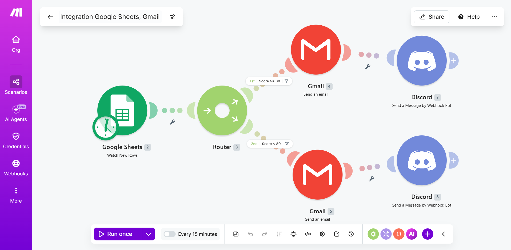
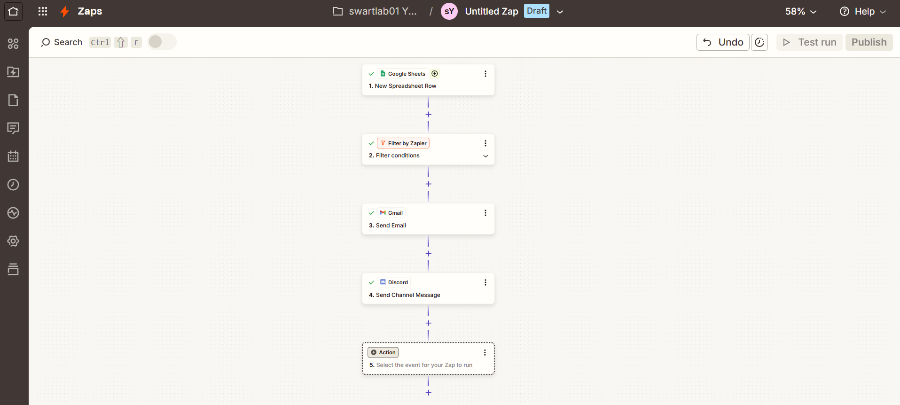
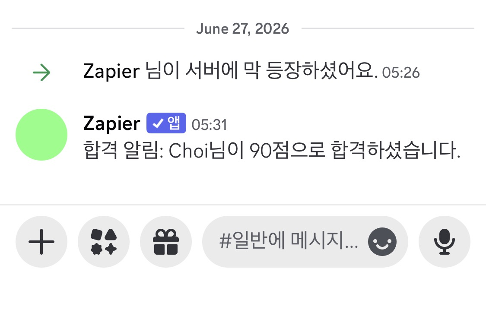
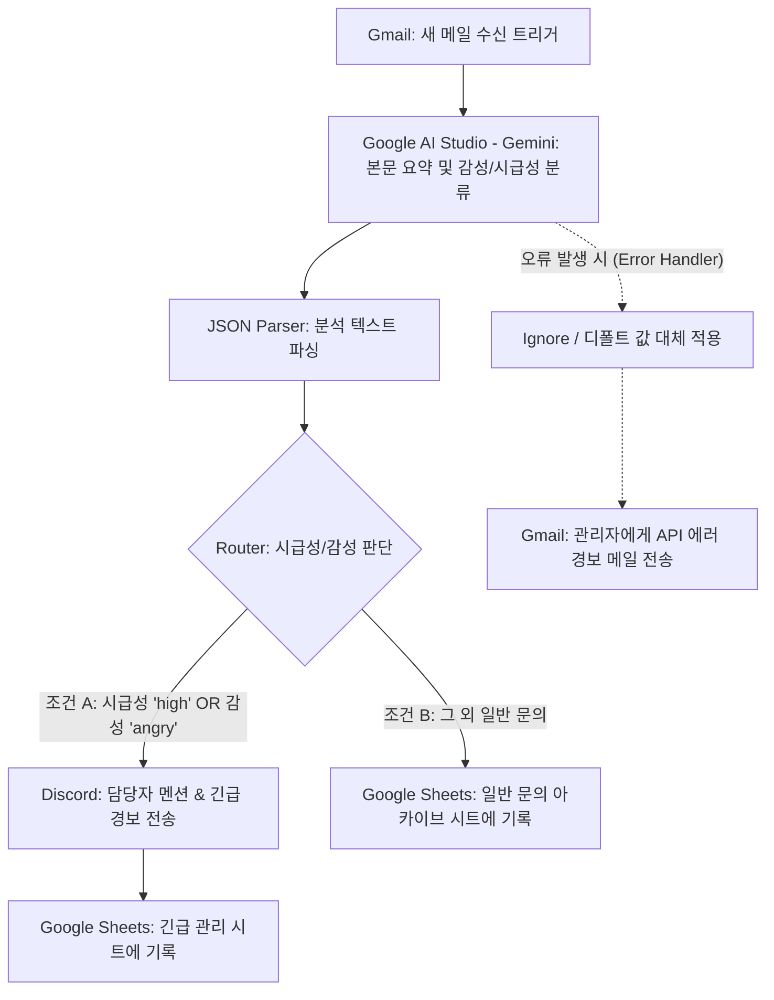
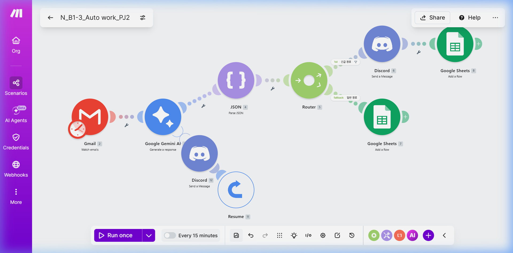
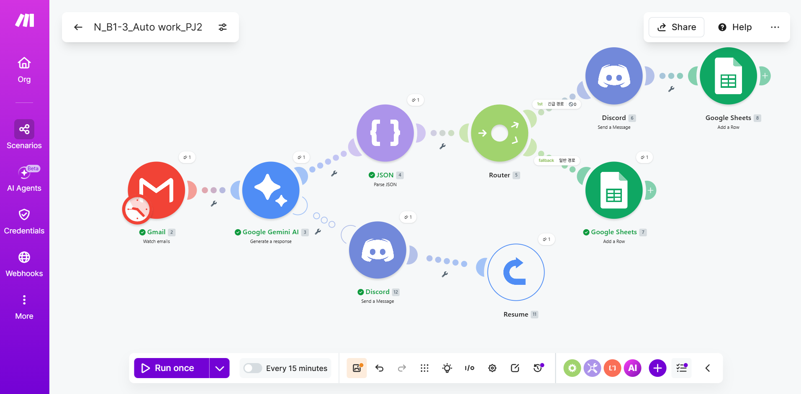

# [과제 보고서] 노코드 자동화 도구 비교 구현 및 AI 연동 자동화 설계
# N_B1-3
코딩 없이 마우스 클릭만으로 일이 자동으로 돌아가게 만들기
---

# [프로젝트 1] 자동화 도구 비교 구현 (Make vs Zapier)

본 프로젝트에서는 동일한 워크플로우를 **Make**와 **Zapier** 두 가지 대표적인 노코드 자동화 도구로 구축하고, 각 도구의 기능과 사용성을 비교 분석하였습니다.

### 1. 구현 워크플로우 정의
- **설문 응답 수집 (Google Forms)**: [설문 응답 제출용 구글 폼](https://forms.gle/QoZVnh5hhnhdFS6M6)
- **시나리오**: "Google Forms 설문 제출 ➡️ Google Sheets 자동 데이터 적재 ➡️ Score(점수) 기준 조건 분기 ➡️ 이메일(Gmail) 전송 및 메신저(Discord) 알림"
- **작동 방식**: 사용자가 구글 폼을 통해 설문을 제출하면 연동된 Google Sheets에 행이 자동으로 추가됩니다. 이후 Score 80점 이상일 경우 '합격 경로'(메일 발송 + Discord 알림), 80점 미만일 경우 '불합격 경로'(메일 발송 + Discord 알림)가 작동하도록 분기 설계하였습니다. (Make는 Router로 양방향 분기, Zapier는 Filter로 합격자만 필터링하는 단일 분기로 구현)

### 2. 구현 과정 요약
- **Make 구현**: 
  1. Gmail이나 Google Sheets 등에서 샘플 데이터를 Watch Rows 트리거로 감지하도록 설정합니다.
  2. Router 모듈을 연결하고 점수 기준으로 `Score >= 80` (합격), `Score < 80` (불합격)의 2개 경로로 필터를 구성합니다.
  3. 합격 경로에는 Gmail(합격 안내 메일)과 Discord(합격 알림 웹훅) 모듈을 차례로 붙이고, 불합격 경로에도 동일한 대응 모듈을 세팅하여 전체 다단계 경로를 완성합니다.
- **Zapier 구현**:
  1. Google Sheets의 `New Spreadsheet Row`를 트리거로 세팅하여 행 데이터를 받아옵니다.
  2. 무료 플랜의 분기 제약을 극복하기 위해 `Filter by Zapier`를 2단계에 추가하여 `Score >= 80` 조건만 통과시키도록 설계합니다.
  3. 필터를 통과한 데이터에 대해 Gmail(합격 안내) 및 Discord(채널 전송) 액션을 덧붙여 단일 필터 자동화를 완료합니다.

---

### 2. 도구별 구현 화면 및 실행 결과

#### 1) Make 구현
- **워크플로우 설계 구성**:
  
  *설명: Google Sheets 트리거 후 Router를 통해 Score 80점 이상/미만의 필터를 적용하고 Gmail과 Discord 모듈로 분기되는 구조.*
** 구글폼 응답 주소 : https://forms.gle/QoZVnh5hhnhdFS6M6

- **실행 결과 화면**:
  
  *설명: 총 6개의 샘플 데이터(Hong, Lim, Kim, Lee, Park, Choi)가 각각의 점수 기준에 따라 합격/불합격 경로로 흐르며 메일 및 메신저로 실시간 통보되는 테스트 성공 이력.*

---

#### 2) Zapier 구현
- **워크플로우 설계 구성**:
  
  *설명: Zapier의 다중 분기(Paths) 기능은 유료 플랜 전용이므로, 14일 트라이얼 환경임에도 무료 플랜 기준 비교를 위해 'Filter by Zapier'를 사용하여 Score 80점 이상의 합격 데이터들(Hong, Kim, Choi)만 통과시켜 Gmail과 Discord로 전송하는 단일 분기 구조로 설계.*

- **실행 결과 화면**:
  
  *설명: Score 80점 이상 데이터 유입 시 필터를 통과하여 이메일 및 Discord 메시지가 성공적으로 전송된 결과 캡처.*

---

### 3. 비교 분석 보고서

| 비교 항목 | Make (Integromat) | Zapier |
| :--- | :--- | :--- |
| **1) UI/UX 및 에디터 방식** | **2차원 시각적 노드 기반** - 마인드맵처럼 모듈을 자유롭게 배치하고 연결선을 그릴 수 있어 복잡한 흐름을 시각적으로 파악하기에 매우 우수함. | **1차원 수직 스텝/리스트 기반** - 위에서 아래로 순차적으로 진행되는 직관적인 구조로, 초보자가 첫 자동화를 만들 때 가장 쉽게 적응할 수 있음. |
| **2) 조건 분기(Filter/Router)** | **강력하고 유연함 (무료)** - Router 모듈을 사용하여 무료 플랜에서도 무제한 다단계 분기가 가능하며 시각적 관리가 쉬움. | **제한적 (유료 기능)** - 다단계 분기(Paths) 기능은 Professional 이상 유료 플랜에서만 제공됨. 14일 트라이얼 기간 중에는 Paths 사용이 가능하나, 본 비교에서는 무료 플랜 기준 대안인 단일 경로 'Filter by Zapier'로 구현하여 비교의 일관성을 유지함. |
| **3) 무료 플랜 혜택** | **매월 1,000 Ops(오퍼레이션) 제공** - 각 블록(모듈)이 작동할 때마다 1 Ops가 소모되며, 개인 및 소규모 테스트용으로 넉넉하게 사용 가능. | **매월 100 Tasks (무료) / 14일 트라이얼로 확장 가능** - 무료 플랜은 100 Tasks/월, 2-Step Zap까지 제한됨. 14일 트라이얼 기간에는 멀티 스텝·Paths 등 유료 기능을 경험할 수 있으나, 이후에는 유료 전환이 필수적이어서 장기적 무료 활용 범위가 매우 좁음. |
| **4) 데이터 디버깅 및 로그** | **최고 수준의 시각적 로그** - 각 실행 시점의 모듈 상단 숫자 풍선을 클릭해 유입/유출된 실제 데이터의 JSON 값을 시각적으로 직접 확인 가능. | **리스트 기반 Task History** - 실행 이력 리스트에서 텍스트 로그 형태로 데이터를 찾아 들어가야 하므로 복잡한 디버깅 시 가독성이 다소 떨어짐. |
| **5) 연동 서비스 범위** | 약 1,500개 이상의 서비스 연동. - 주요 서비스는 대부분 지원하지만 비인기 앱의 경우 연동 모듈이 없을 수 있음. | **약 6,000개 이상의 서비스 연동** - 전 세계에서 가장 많은 커넥터를 보유하고 있어, 틈새 도구 및 독특한 SaaS 연동에 절대적 우위를 가짐. |

#### 종합 장단점 및 적합 상황 의견
- **Make**:
  - *장점*: 무료 플랜의 혜택이 크고, 무제한 조건 분기가 가능하며 시각적 디버깅 성능이 압도적임.
  - *단점*: 초기 UI 진입 장벽이 있어 흐름 제어나 데이터 매핑 규칙(Data type 등)을 학습하는 데 시간이 다소 걸림.
  - *추천 상황*: 무료로 고성능의 다단계 분기 및 복잡한 비즈니스 로직(AI 연동, 루프 등)을 설계하고 싶을 때 강력히 추천.
- **Zapier**:
  - *장점*: 설정이 극도로 직관적이고 친절하며, 전 세계 거의 모든 웹 서비스와의 연동 모듈을 완벽하게 지원함.
  - *단점*: 조금만 복잡한 분기나 멀티 액션을 넣으려고 해도 과금 허들이 매우 높음.
  - *추천 상황*: 예산이 충분하고 복잡한 기술적 학습 없이 몇 분 만에 대중적인 서비스(구글, 슬랙, 캘린더 등) 간의 간단한 연결을 끝내고 싶을 때 적합.

---
---

# [프로젝트 2] 자유 주제 자동화 설계 및 구현

## 1. 자동화할 반복 업무 정의
- **업무 시나리오**: "수신되는 고객 이메일을 분석하여 요약, 감정, 긴급도를 인공지능이 자동 분류하고, 결과에 따라 메신저 알림 발송 및 분류 시트 적재를 자동으로 처리하는 시스템"
- **페인 포인트(Pain Point)**: 매일 수십 건씩 유입되는 고객 문의 메일을 사람이 일일이 열어보고 심각성을 분류한 뒤 담당 부서에 메신저로 복사-붙여넣기하여 인계하는 과정에서 지체 시간이 생기고 수작업 오류가 발생함.
- **기대 효과**: AI가 즉각적으로 메일을 분석하여 '불만/화남'이나 '긴급' 메일을 1분 이내로 감지해 Discord로 실시간 알림을 보냄으로써 고객 대응 품질과 속도를 비약적으로 향상시킴.

## 2. 자동화 도구 선정 및 이유
- **선정 도구**: **Make (메이크)**
- **선정 이유**:
  1. 무료 플랜에서도 이메일 수신, Google AI Studio(Gemini) API 호출, 조건 분기, 스프레드시트 기록까지 일련의 다단계(Multi-step) 과정을 추가 비용 없이 완벽히 구현할 수 있음.
  2. **Google AI Studio (Gemini)** 모듈이 기본 내장되어 있어 API Key 입력만으로 손쉽게 연동 가능하며, Gemini API는 무료 티어를 제공하여 추가 결제 없이 사용 가능.
  3. API 오류나 시트 작성 오류 시 시나리오 중단을 막고 대체 작동을 지원하는 **에러 핸들러(Error Handler)**를 유연하게 구성할 수 있기 때문임.

## 3. 워크플로우 설계 문서 (다이어그램 및 설명)

### 1) 흐름 다이어그램 (Flow Control)

### 2) 모듈별 세부 역할 설명
- **Gmail (Watch Emails)**: 수신 메일함에서 안 읽은 새 이메일을 감지하여 제목, 발신자, 본문 텍스트를 추출합니다.
- **Google AI Studio - Gemini (Make HTTP Module 또는 Google AI Studio 모듈)**: 시스템 프롬프트를 통해 이메일 본문을 입력받아 감정 상태(`angry`, `positive`, `negative`, `neutral`)와 시급성(`high`, `medium`, `low`), 1줄 요약본을 정확히 JSON 형태로만 반환하도록 지시합니다. (Gemini 2.0 Flash 모델 사용, 무료 티어)
- **JSON (Parse JSON)**: Gemini의 텍스트 응답을 Make 내부 변수 구조로 해석합니다.
- **Router (Filters)**:
  - **긴급 채널**: `urgency = high` 이거나 `sentiment = angry`일 경우 즉각 Discord로 푸시 알림을 주어 담당자가 골든 타임 내에 조치하도록 돕고, 별도의 긴급 대응 구글 시트에 기록합니다.
  - **일반 채널**: 그 외의 문의는 단순 아카이브용 스프레드시트에 차곡차곡 요약본과 함께 저장합니다.
- **Error Handler (Gmail Alert)**: Gemini API에 일시적인 장애(지연, 레이트 리미트 초과 등)가 발생하면 시나리오를 멈추지 않고(Ignore), 디폴트 분류값(`요약: 분석 오류, 긴급도: medium`)을 적용한 뒤, 관리자 메일로 에러 로그를 전송하여 대응 안정성을 확보(보너스 과제 2 해결)합니다.

## 4. 구현 및 실행 결과 캡처

### 1) Make 구현 화면
- **에러 핸들러가 포함된 전체 시나리오 설계 스크린샷**:
  
  *설명: Gmail 트리거와 Google AI Studio(Gemini) 모듈, Router 분기 및 Gemini 모듈 하단에 배치된 에러 핸들러(Ignore) 노드 확인.*

### 2) 실행 결과 화면
- **AI 연동 이메일 분석 및 알림 전송 결과**:
  
  *설명: Gemini API 호출 시 일시적인 한도 초과 오류(429)가 발생하더라도, 설계된 에러 핸들러(Discord 에러 알림 + Resume 대체값 투입)가 성공적으로 작동하여 전체 워크플로우가 중단되지 않고 최종 구글 시트(일반 아카이브) 기록 단계까지 완벽하게 완료(모든 모듈 초록색 체크)된 작동 내역 캡처.*
